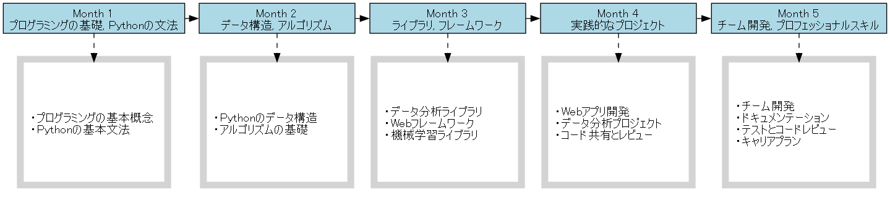

# Lecture Generator

Lecture Generatorは、講義シリーズの資料を自動生成する便利なPythonプロジェクトです。
マスターシラバスに基づいて、個々の講義資料をマークダウン形式で生成します。これにより、講義の準備時間を大幅に短縮できます。さらに、講義の全体像をGraphVizを使って視覚的に表現します。これにより、講義の流れや関連性が一目で把握できます。Lecture Generatorで、効率的かつ魅力的な講義資料を作成しましょう！

## 必要条件

- Python 3.x
- GraphViz
- PyYAML

## インストール

1. このリポジトリをクローンまたはダウンロードします。

2. 必要なPythonパッケージをインストールします。
   ```
   pip install graphviz pyyaml
   ```

## 使用方法

1. `./transcript.txt` に書きたい書籍の読み上げ文章を書き込みます
2. 以下のコマンドを実行し、読み上げ文章からシラバスを作成します。
   ```
   python 1_transcript_to_syllabus.py
   ```
   このスクリプトは、`./transcript.txt`に書かれた読み上げ文章を読み込み、それをもとにシラバスを生成します。生成されたシラバスは`data/syllabus.yaml`に保存されます。
   また、講義の全体像を示す画像が `syllabus_graph.png` に生成されます。

3. 次に、以下のコマンドを実行し、シラバスから書籍を作成します。
   ```
   python 2_syllabus_to_book.py
   ```
   このスクリプトは、`data/syllabus.yaml`に保存されたシラバスを読み込み、それをもとに書籍の各章や節を生成します。生成された書籍の内容は`data/`ディレクトリ内に保存されます。


4. 生成された資料は `data/` ディレクトリ内の対応する週のサブディレクトリに保存されます。

## 要件定義書の変更について

- syllabus.yaml 
のファイルを書き換えると、求めているカリキュラムに修正が可能です。

- AIdocs/書籍生成AI.md

のファイルを書き換えると、求めている文章形式になります。
うまく動作しない場合は `ais`内の該当ファイルを修正してください。


## 主要ファイルについて
- 1_transcript_to_syllabus.py
   - YAML形式のシラバスを作成するスクリプトを自動生成するスクリプト
- 2_syllabus_to_book.py
   - 書籍を作成するスクリプトを自動生成するスクリプト
- generate_book.py
   - 書籍を作成するスクリプト
- generate_syllabus_graph.py
   - シラバスをグラフ化してpngファイルとして保存するスクリプト
- syllabus_graph.png
   - シラバスをグラフ化した写真ファイル
   
- transcript.txt
   - 講義のシラバスとして作成したい内容をまとめたテキスト
- book/week_*/*md
   - 各週の講義資料
      - [Week1](book/week_1/)
      - [Week2](book/week_2/)
      - [Week3](book/week_3/)
      - [Week4](book/week_4/)
      - [Week5](book/week_5/)
- data/syllabus.yaml
   - 講義のシラバス
- llms/claude.txt
   - スクリプト自動生成のプロンプトテンプレ


## フォルダ構成
```
lecture_generator/

.
├── AIdocs
│   └── 書籍生成AI.md
├── ais
│   └── lecture_generator.md
│   └── quiz_generator.md
├── book
│   ├── week_1
│   │   └── Pythonの基本文法.md
│   │   └── プログラミングの基本概念.md
│   ├── week_2
│   │   └── Pythonのデータ構造.md
│   │   └── アルゴリズムの基礎.md
│   ├── week_3
│   │   └── Webフレームワーク.md
│   │   └── データ分析ライブラリ.md
│   │   └── 機械学習ライブラリ.md
│   ├── week_4
│   │   └── customer_data.csv
│   │   └── product_prices.csv
│   │   └── sales_data.csv
│   │   └── Webアプリ開発.md
│   │   └── コード共有とレビュー.md
│   │   └── データ分析プロジェクト.md
│   ├── week_5
│   │   └── キャリアプラン.md
│   │   └── チーム開発.md
│   │   └── テストとコードレビュー.md
│   │   └── ドキュメンテーション.md
├── data
│   ├── __pycache__
│   │   └── master_syllabus.cpython-311.pyc
│   └── syllabus.yaml
├── llms
│   └── claude.txt
├── templates
│   └── lecture_template.md
│   └── weekly_syllabus_template.md
├── utils
│   ├── __pycache__
│   │   └── generator.cpython-311.pyc
└── .gitignore
└── 1_transcript_to_syllabus.py
└── 2_syllabus_to_book.py
└── generate_book.py
└── generate_syllabus_graph.py
└── README.md
└── syllabus_graph
└── syllabus_graph.png
└── transcript.txt


```

## ライセンス

このプロジェクトは [MIT ライセンス](LICENSE) の下で公開されています。
